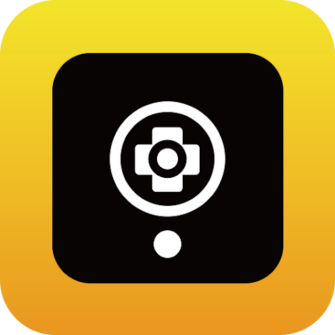

#### I am a student researcher at [LiraLab](https://liralab.usc.edu/people/) interested in DeepRL for Robotics 🤖

- ⚙️ I use daily: `.py`, `.cpp`, `.sh`, `.lua`, `.cu`
- 💡 Exploring: Robot Learning, Reinforcement Learning, Lifelong Learning

#### Worked at:

